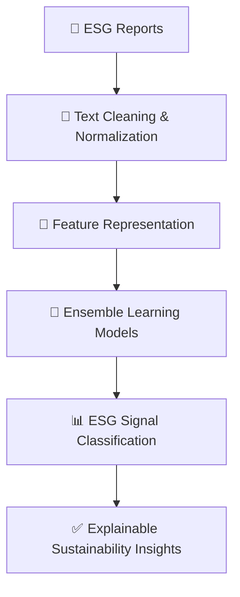
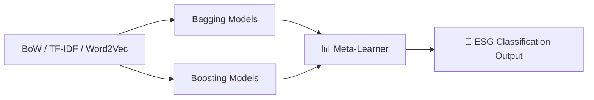

# 🌍 ESG Signal Extraction from Corporate Disclosures  
## 📊 NLP & Ensemble Learning for Sustainability Intelligence

> 🟢 **Status:** Completed Applied ML Project  
> 🎓 **Level:** Graduate (M.Tech – Artificial Intelligence & Machine Learning)  
> 🧠 **Focus:** NLP · Sustainability Analytics · Explainable Machine Learning  

---

## ✨ Executive Summary

Environmental, Social, and Governance (ESG) analysis is increasingly central to **investment decisions, regulatory compliance, and corporate accountability**.  
Yet, most ESG information remains embedded in **unstructured, narrative-heavy corporate disclosures**, making it difficult to scale, standardize, and quantify.

This project presents a **robust NLP-driven machine learning pipeline** that transforms ESG narratives into **interpretable, reproducible sustainability signals**, using **classical NLP and ensemble learning techniques**.

Rather than relying on opaque deep learning models, the system emphasizes **explainability, statistical rigor, and deployment realism** — key requirements in sustainability and regulatory contexts.

---

## 🎯 Problem Motivation

🔍 ESG data presents a structural challenge:

| 📈 Financial Data | 🌱 ESG Data |
|------------------|------------|
Structured & numeric | Narrative & contextual |
Standardized | Linguistically diverse |
Machine-readable | Analyst-interpreted |
Easily scalable | Hard to automate |

📌 **Goal:** Convert unstructured ESG narratives into **machine-interpretable signals** while preserving transparency.

---

## 🧠 System Overview

### 🔗 End-to-End ESG Analytics Pipeline



---

## ⚙️ NLP & Feature Engineering Strategy

### 🧹 Text Conditioning
- Tokenization tuned to corporate language
- Lemmatization to normalize policy phrasing
- Removal of boilerplate ESG rhetoric
- Domain-aware stopword pruning

### 🧠 Feature Representations

| 🧩 Technique | 🔍 Purpose |
|-------------|-----------|
Bag-of-Words | Captures disclosure presence |
TF–IDF | Emphasizes material ESG terms |
Word2Vec | Learns semantic relationships |

---

## 🤖 Ensemble Learning Strategy



---

## 📊 Key Insights

- ESG intent can be detected using **statistically grounded NLP**
- Feature engineering often outweighs model complexity
- Classical ML remains competitive where interpretability matters

---

## 🛠️ Technology Stack

Python 🐍 · NLTK · Gensim · Scikit-learn · Pandas · NumPy · Jupyter

---

## 📁 Repository Structure

```
esg-report-classification-nlp/
├── notebooks/
├── data/
├── docs/
├── requirements.txt
├── .gitignore
└── README.md
```

---

## 🚀 How to Run

```bash
pip install -r requirements.txt
jupyter notebook
```

---

## 🌍 Applications

- ESG screening for investments
- Sustainability risk assessment
- Regulatory compliance tooling
- Corporate ESG benchmarking

---

## 👤 Author

**Kupakwashe T. Mapuranga**  
M.Tech – Artificial Intelligence & Machine Learning
